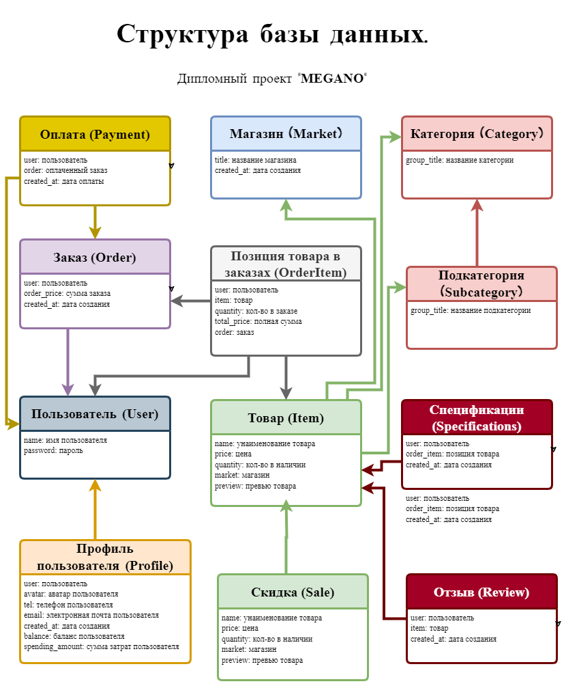

# **Django проект "MEGANO"**
___

Данный проект создавался в качестве дипломной работы, по курсу Python и Django.

## Что из себя представляет проект
Проект представляет из себя мульти-брендовый агрегатор товаров. Состоит из части frontend`a и backend`a в виде API.

## Установка проекта:
1. Клонируйте репозиторий на свой локальный компьютер:
   + git clone https://gitlab.skillbox.ru/iurii_shilov/PA_Python_DPO_bot
2. Перейдите в директорию проекта. 
3. Создайте виртуальное окружение и активируйте его:
   + python3 -m venv venv
   + source venv/bin/activate
4. Установите зависимости проекта:
   + pip install -r requirements.txt
5. Собрать пакет: в директории diploma-frontend выполнить команду python setup.py sdist
6. Установить полученный пакет в виртуальное окружение: `pip install diploma-frontend-X.Y.tar.gz`. X и Y - числа, они могут изменяться в зависимости от текущей версии пакета.
7. Примените миграции базы данных:
   + python manage.py migrate

Если запустить сервер разработки: `python manage.py runserver`, то по адресу `127.0.0.1:8000` должна открыться стартовая страница интернет-магазина:


Для демонстрации предусмотрены фикстуры. Чтобы их установить введите:
   + python manage.py loaddata markets.json - загружает модель магазина
   + python manage.py loaddata category.json - загружает модели категорий
   + python manage.py loaddata subcategory.json - загружает модели субкатегорий
   + python manage.py loaddata items.json - загружает модели товара
   + python manage.py loaddata itemimage.json - загружает модели изображений товара

## Использование

API предоставляет следующие эндпоинты:
- `api/categories/` - передает данные для заполнения меню категорий
- `api/tags/` - передает данные по тэгам
- `api/product/<int:id>/` - передает данные с деталями запрашиваемого товара
- `api/product/<int:id>/reviews/` - передает данные отзывов на запрашиваемый товар
- `api/products/popular/` - передает данные для отображения на главной странице популярных товаров
- `api/products/limited/` - передает данные для отображения на главной странице товар лимитированного тиража
- `api/banners/` - передает данные для отображения баннеров
- `api/catalog/` - передает данные для работы каталога
- `api/orders` - передает данные для отображения списка заказов пользователя
- `api/order/<int:id>` - передает данные для отображения деталей заказа
- `api/payment/<int:id>` - передает данные для отображения деталей заказа
- `api/sales` - передает данные для отображения товара со скидкой
- `api/sign-out/` - совершает выход из аккаунта пользователя
- `api/sign-in/` - для авторизации пользователя
- `api/sign-up` - для регистрации нового пользователя
- `api/profile` - передает данные для деталей профиля зарегистрированного пользователя
- `api/profile/avatar` - передает данные для изменения аватара пользователя
- `api/profile/password` - передает данные для изменения пароля пользователя
- `api/cart` - передает данные для отображения страницы корзины пользователя
- `api/basket` - выполняет добавление или удаление товара из карзины пользователя

Для создания пользователя с правом администратора:
- python manage.py createsuperuser

Для входа в админку - /admin/

## Структура моделей проекта


# Детали подключаемого приложения `frontend` (Для проверяющих преподавателей)
Приложение служит только для отрисовки шаблонов из `templates/frontend`, поэтому в `urls.py` напрямую 
используются `TemplateView` из стандартной поставки Django.

В качестве frontend фреймворка был использован Vue3, который подключается в базовом шаблоне `templates/frontend/base.html`:
```html
<script src="https://unpkg.com/vue@3/dist/vue.global.js"></script>
```
JS скрипт `static/frontend/assets/js/app.js` содержит реализацию Vue объекта, а все остальные JS скрипты из 
директории `static/frontend/assets/js` реализуют объекты примеси для соответствующей страницы проекта.
